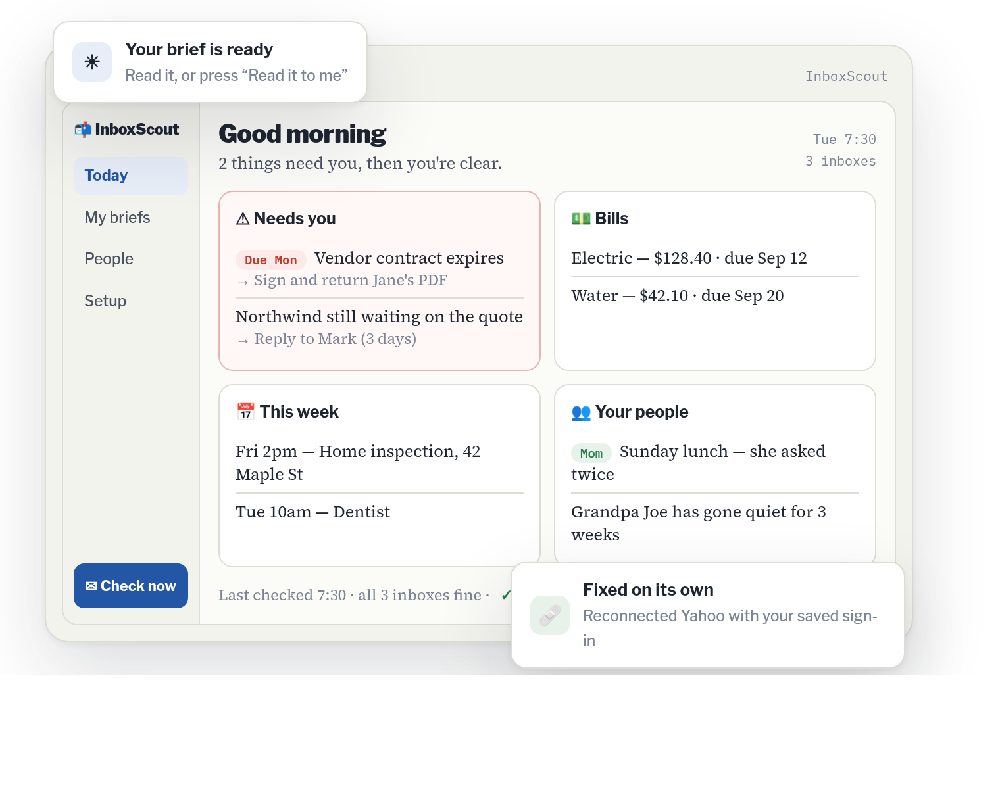
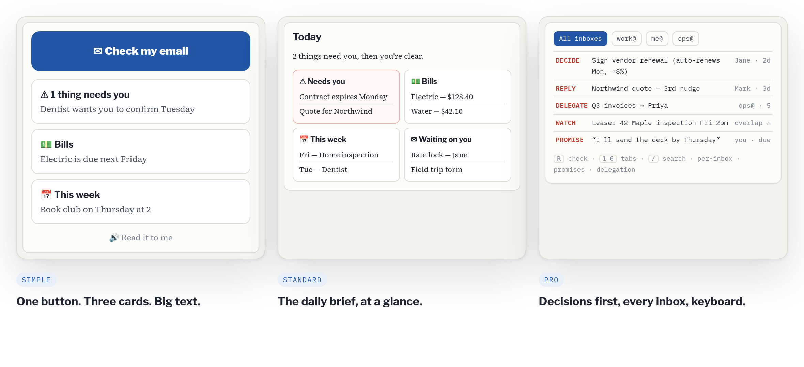

<p align="center">
  
</p>

<h1 align="center">InboxScout</h1>

<p align="center">
  <strong>Know what needs you. Skip the rest.</strong><br/>
  A free desktop app that reads your email and hands you a 30-second brief, in plain words.
</p>

<p align="center">
  <a href="https://github.com/thatcooperguy/InboxScout/releases/latest/download/InboxScout-Setup.exe"></a>
  &nbsp;
  <a href="https://github.com/thatcooperguy/InboxScout/releases/latest/download/InboxScout-arm64.dmg"></a>
  &nbsp;
  <a href="https://github.com/thatcooperguy/InboxScout/releases/latest/download/InboxScout-x64.dmg"></a>
  &nbsp;
  <a href="https://github.com/thatcooperguy/InboxScout/releases/latest/download/InboxScout-x64.AppImage"></a>
</p>

<p align="center">
  <sub>Free forever · no account · never sends or deletes your mail · updates itself · <a href="https://inboxscout.ai">inboxscout.ai</a></sub>
</p>

<p align="center">
  <a href="https://github.com/thatcooperguy/InboxScout/releases/latest"></a>
  <a href="https://github.com/thatcooperguy/InboxScout/actions/workflows/ci.yml"></a>
  <a href="LICENSE.md"></a>
  
  
</p>

<p align="center">
  
</p>

Email is where the important stuff hides: the contract that expires Monday, the bill that's due, the client who has been waiting three days, the school form that needs signing. InboxScout reads it all so you don't have to, and gives you one calm screen:

> **Needs you** · **Bills** · **This week** · **Your people** · **Waiting on you** — or simply ✅ *You're all caught up.*

It works for a small-business owner, a real-estate agent, a nurse, a lineworker, and your parents, because it adapts to what you do instead of making you adapt to it.

## 🚀 Two minutes to set up

1. **Download** — [Windows](https://github.com/thatcooperguy/InboxScout/releases/latest/download/InboxScout-Setup.exe) · [Mac with Apple Silicon (M1–M4)](https://github.com/thatcooperguy/InboxScout/releases/latest/download/InboxScout-arm64.dmg) · [Mac with Intel](https://github.com/thatcooperguy/InboxScout/releases/latest/download/InboxScout-x64.dmg) · Linux: [AppImage](https://github.com/thatcooperguy/InboxScout/releases/latest/download/InboxScout-x64.AppImage) · [.deb](https://github.com/thatcooperguy/InboxScout/releases/latest/download/InboxScout-x64.deb). Not sure which Mac? Apple menu → *About This Mac*.
2. **Connect your email** — Gmail, Yahoo, iCloud, Outlook.com, Hotmail, or any other mailbox. Read-only, always.
3. **Say what you do — or don't** — pick from 56 kinds of people, or let InboxScout work it out from your mail.

Then press **Check my email**. Your first brief is ready before your coffee cools.

> **One-time warning at install:** the installers aren't code-signed yet (we're in the friends-and-family stage).
> **Windows:** *"Windows protected your PC"* → **More info** → **Run anyway**.
> **macOS:** *"InboxScout can't be opened"* → **System Settings → Privacy & Security** → **Open Anyway**.
> **Linux:** make the AppImage executable — right-click → Properties → Allow executing, or `chmod +x InboxScout-x64.AppImage` — or install the .deb with `sudo apt install ./InboxScout-x64.deb` ([Linux notes](docs/LINUX.md)).
> After that, the app updates itself (on Linux: the AppImage does; the .deb is updated through apt).

## 🎚 Simple enough for a grandparent, sharp enough for a CEO

<p align="center">
  
</p>

The same app shows more as you use more. **Simple** is one big button, three cards, big text, and a voice that reads the brief out loud. **Standard** is the daily brief at a glance. **Pro** is decisions first, every inbox, keyboard all the way. InboxScout picks from how you use it, changes at most once a week, always tells you, and always lets you go back or lock it. Every setting says what it does and why. [How it decides →](docs/ADAPTIVE.md)

## ✨ What it does

| | |
|---|---|
| 📬 **Reads all your mail, read-only** | Gmail, Yahoo, iCloud, Outlook.com, Hotmail, any IMAP mailbox, several at once. It can never send, delete, or move anything. |
| 🧠 **Sorts personal from work** | Plus what needs a reply, what's a newsletter, what's a receipt, and a quiet heads-up when something contains sensitive information. |
| 🔎 **Watches for what matters to you** | Bills, appointments, deals, work orders, deliveries, travel, school, health, job search, customer requests, the people you care about. Tick what fits. [Skills →](docs/SKILLS.md) |
| 🧭 **Knows who you are** | 56 profiles: nurse, contractor, teacher, landlord, retiree, developer, pastor, caregiver, restaurant owner and more. Each tunes what counts as work, what's urgent, and what your brief tracks. [Profiles →](docs/PROFILES.md) |
| 👥 **Knows your people and your week** | Learns who matters across every inbox, tells you when someone has gone quiet, gathers the week's dates from all your accounts, and remembers what you promised. Nothing to set up. [Insights →](docs/INSIGHTS.md) |
| 📰 **Daily or weekly brief** | Top issues with a next step each, a pulse on your projects or deals, a reply tracker, and upcoming dates. Saved as HTML, PDF, and Markdown. |
| 📨 **Comes to you** | Email yourself the brief, get the headline as a text message, or have InboxScout read it out loud when it's ready. It only ever sends to *you*. |
| 📱 **On your phone (iPhone & Android)** | Setup → *On your phone* shows a QR code. Scan it on the same Wi‑Fi and your phone gets a phone-sized InboxScout: check email, what needs you, bills, this week, past briefs. Add it to your home screen and it works like an app. Works only on your own network with its own code; *New code* cuts off anyone who had the old link. [Phone →](docs/PHONE.md) |
| ✍ **Helps you act** | One click opens a reply draft in your own mail app (you send it), adds dates to your calendar, exports a list, or saves briefs to Google Docs and Sheets. |
| 🩹 **Fixes itself** | Checks its own health on every run and quietly repairs what it safely can: reconnects an account, falls back to the built-in engine when an AI helper fails, finds a new home for your reports. When something really needs you, it says so in plain words with one **Fix it for me** button. [Self-healing →](docs/SELF-HEALING.md) |
| 🤖 **Does the fiddly parts for you** | An assistant opens its own browser window and handles setup chores (app passwords, connecting accounts) or any web task you describe. Save a sign-in and it logs in for you; the AI never sees the password. There's always a Stop button. [Assistant →](docs/ASSISTANT.md) |
| 🖥 **Uses your whole computer, and asks first** | It can open apps and files, click and type, run commands, and work with files in your home folder. The first time it does each kind of thing, a popup asks you. One switch turns it all off. [System control →](docs/SYSTEM-CONTROL.md) |
| 🤝 **Works with Hermes and other agents** | Turn on the local Agent bridge and InboxScout becomes a tool for Hermes, Claude Code, or any MCP client, with a REST API and a live event stream. Read-only or full access, your choice. [Hermes →](integrations/hermes/) |
| 💸 **Free, works out of the box** | A built-in engine runs entirely on your computer with no account. Optionally connect Gemini, Groq, OpenRouter, Mistral, DeepSeek, OpenAI, Claude, Grok, Ollama, LM Studio, or any OpenAI-compatible endpoint for smarter results. |
| 🔒 **Local-first and private** | Everything lives in a local database; passwords and keys are locked with your OS keychain. Email content only goes to the AI you choose, or nowhere. |

## 👋 Who it's for

- **Parents and grandparents** — one big button, three cards, larger text, and a voice that reads the brief. Set it up for them in two minutes; it stays out of their way.
- **Small-business owners** — customer requests, invoices, contracts, and the replies you owe, ranked by what will hurt if it slips. Across every inbox you run.
- **Agents, landlords, and trades** — every deal, unit, or job tracked by address and stage. Expiring dates, inspections, and unanswered clients surfaced first.
- **Executives and managers** — decisions first. Delegate with a click, see the promises you made, keep one schedule across work and life.

<details>
<summary><strong>Connecting Gmail, Yahoo, iCloud, Outlook</strong></summary>

**Gmail's best option is "Sign in with Google"**: a normal Google sign-in page, no app password, and InboxScout gets Gmail's own Promotions/Social/Updates labels and Important markers for much better sorting. It needs a one-time free Google setup by whoever installs InboxScout ([docs/GOOGLE.md](docs/GOOGLE.md)).

Otherwise Gmail, Yahoo, and iCloud use an **app password** (a special 16-character password just for InboxScout). The setup screen shows the steps for whichever provider you pick, or the built-in assistant can create it for you:
- Gmail: turn on 2-Step Verification, then [myaccount.google.com/apppasswords](https://myaccount.google.com/apppasswords)
- Yahoo: Account Security → *Generate and manage app passwords*
- iCloud: [appleid.apple.com](https://appleid.apple.com) → Sign-In and Security → App-Specific Passwords

**Outlook.com / Hotmail / Live** sign in with a short code instead of a password. A one-time free app registration is needed by whoever sets up InboxScout ([docs/OUTLOOK.md](docs/OUTLOOK.md)).
</details>

<details>
<summary><strong>Make it yours</strong></summary>

- **Setup → What to watch for** — tick the skills that matter in your life; name your *Important people*; list senders to *Never bother me about*.
- **Setup → AI helper** — free built-in engine by default; connect any AI in one click for smarter briefs.
- **Setup → Preferences** — schedule (daily 7:30 by default), text size, work profile, privacy, the Agent bridge, and **Send me my brief** (email / text).
- **Settings → Who can help** — how far the assistant goes, what it may do on your computer, and the remembered answers to its popups.
- **Settings → Health** — what InboxScout checked, what it fixed, and **Fix it for me**.
</details>

<details>
<summary><strong>For developers</strong></summary>

```bash
npm install
npm run dev          # launch with hot reload
npm run typecheck    # strict TS across main + renderer
npm test             # vitest
npm run lint
npm run package      # build local installers (no publish)
node scripts/render-media.mjs   # regenerate README/site images from the landing page CSS
```

Headless scan: `inboxscout --sync`. Stack: Electron · TypeScript · React · better-sqlite3 (FTS5) · imapflow + mailparser · Microsoft Graph (MSAL) · Vercel AI SDK · node-cron · electron-updater.

Website: [inboxscout.ai](https://inboxscout.ai) ([how it's hosted](docs/WEBSITE.md)) · Maintainer checklist: [docs/TODO-AT-PC.md](docs/TODO-AT-PC.md) · [Roadmap](docs/ROADMAP.md) · [Releasing](docs/RELEASING.md) · [Contributing](CONTRIBUTING.md) · Design docs: [Proposal](docs/PROPOSAL.md), [Human factors](docs/design/HUMAN-FACTORS.md), [Adaptive UI](docs/design/ADAPTIVE-UI.md)
</details>

## 📜 License

InboxScout is **source-available** under the [Functional Source License 1.1, MIT future license (FSL-1.1-MIT)](LICENSE.md): free to use, read, modify, and redistribute for any internal, personal, educational, or research purpose; not for building a competing product; each release becomes plain **MIT two years** after it is published. "InboxScout" and the logo identify this project; the license grants no trademark rights.
